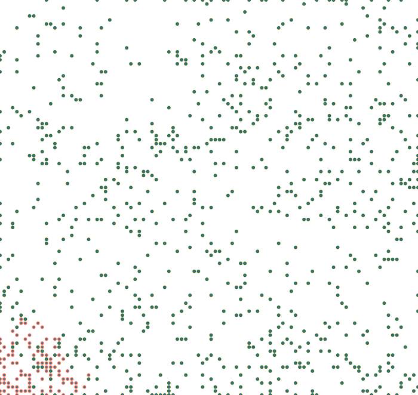
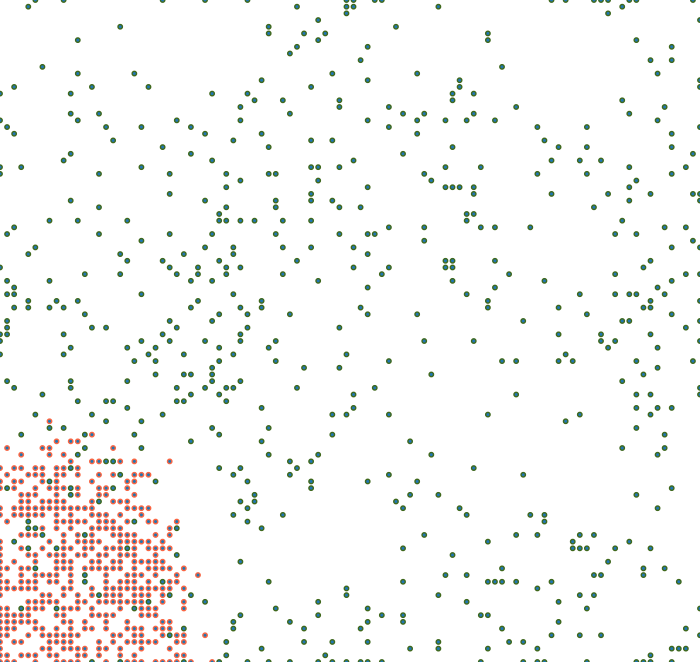
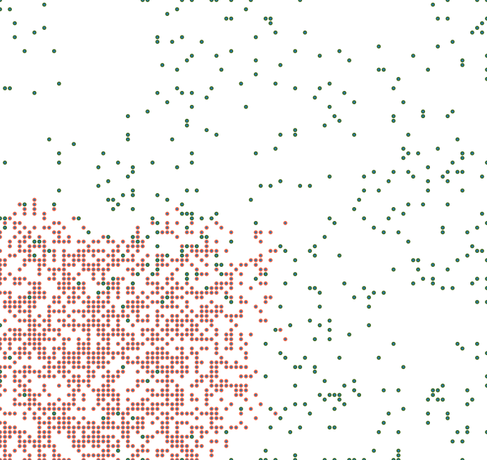
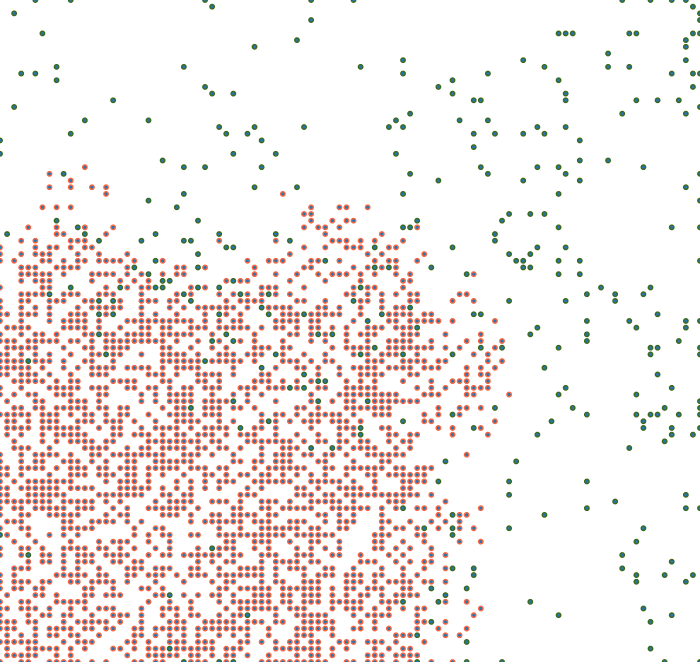
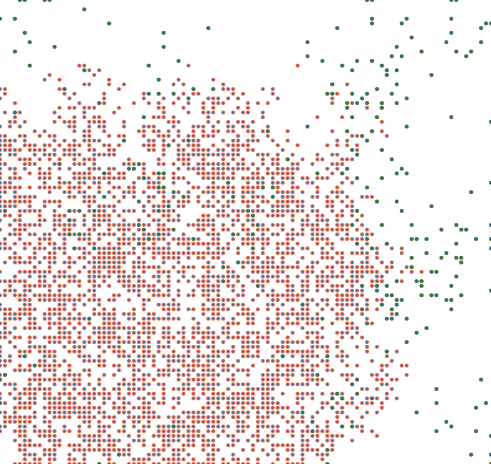
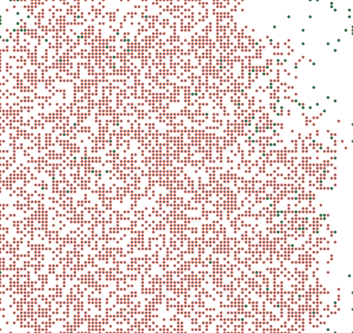

# plant-distribution
Simulation for inversive plant distribution.

The images below are taken from the animation that visualizes the simulation. It can be observed that the weed (in red) spreads and displaces the original plants (green). 

```html
<p float="left">
  
   
  
</p>
<p float="left">
  
   
  
</p>


```

